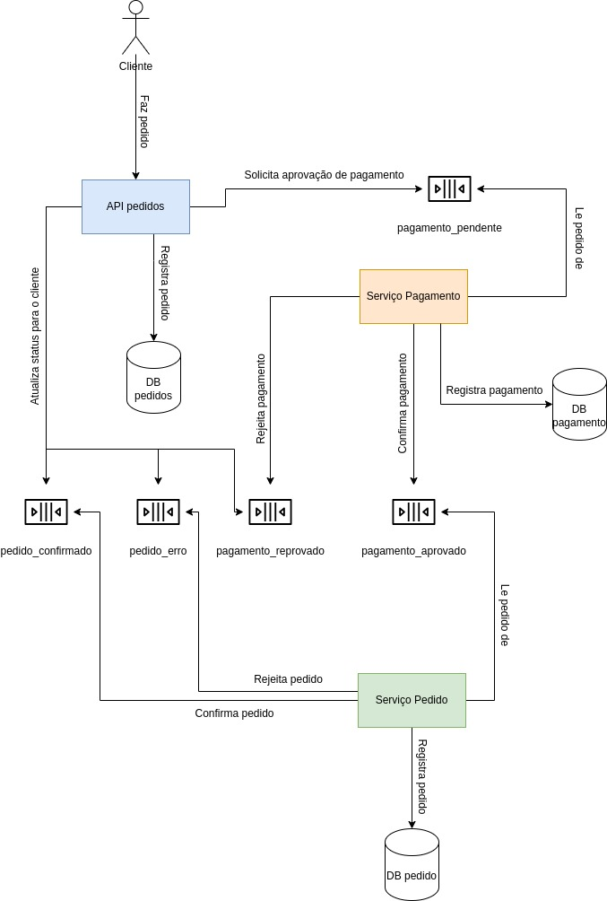

# hexagonal-order-api

Esta aplicacao fornece uma API construida com base nas boas praticas de desenvolvimento.

Para subir a aplicacao em ambiente de desenvolvimento:

- Utilize o Docker Compose para subir o ambiente completo
- - Rode `docker compose build`
- - Rode `docker compose up`
- - Certifique que possui um schema no seu banco de dados chamado lanchonete

Em ambientes produtivos, temos uma pasta *terraform* com a estrutura criada para deploy em Cloud. nesta pasta estão separados os scripts para deploy baseado na stack a seguir:

- RDS com Postgres
- ECR e ECS
- API Gateway com autenticação com Cognito

A arquitetura do projeto está definida no desenho a seguir, inclusive com o padrão SAGA Coreografado:

Esta aplicação não passou por nenhum problema de segurança segundo o relatório do Owasp Zap a seguir:
[Relatório Owasp Zap](docs/2024-08-06-ZAP-Report-.html)

Esta solução também possui um documento RIPD com todas as informações legais sobre a LGPD:
[Relatório RIPD](docs/RIPD.docx)